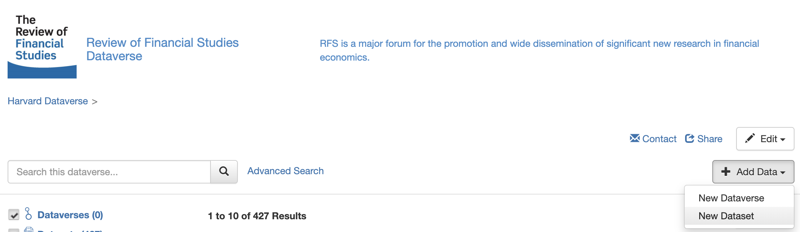
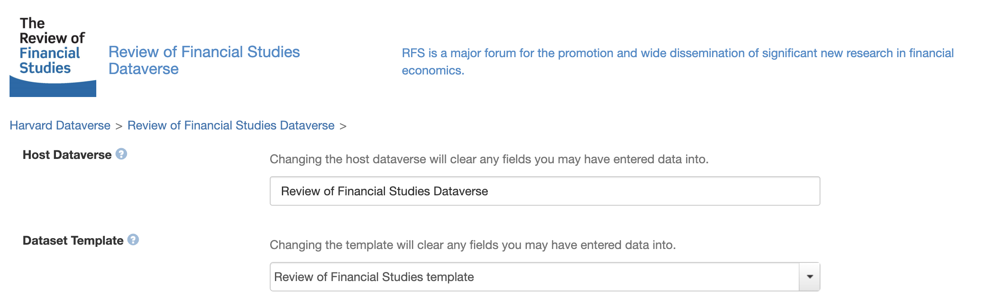
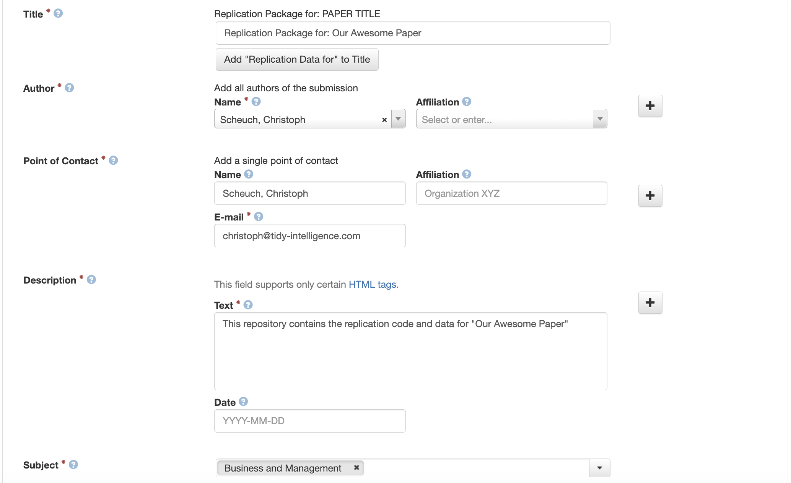
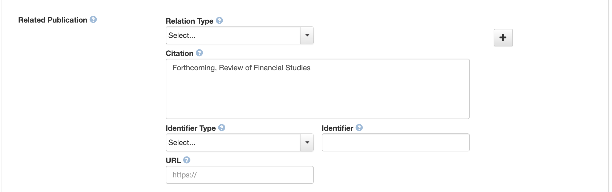
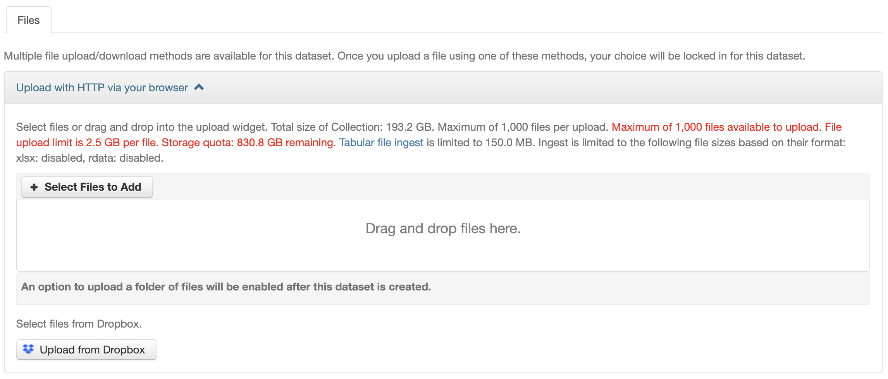
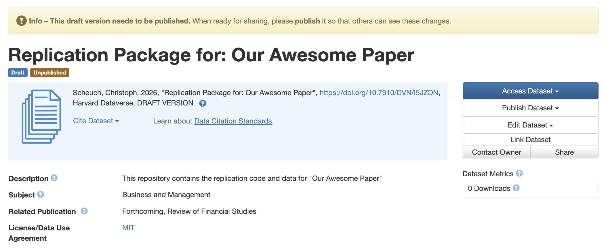

This page walks you through uploading your replication package to the [RFS Dataverse](https://dataverse.harvard.edu/dataverse/rfs/). It assumes you have already created a Harvard Dataverse account and are logged in.

## Why the RFS Dataverse?

The RFS Dataverse is the official archive for replication materials accompanying papers published in the *Review of Financial Studies*. A few practical advantages worth knowing up front:

- **Privacy during review.** Your materials remain private (visible only to the authors and the Data Editors) until the Data Editor process is complete and the dataset is explicitly published.
- **Persistent versioning.** Once a replication package is published, any subsequent updates create new versions while older versions remain online. This protects the integrity of the published record and gives readers a stable target to cite.
- **DOI and citation.** Each dataset receives a permanent DOI that can be cited alongside the paper.
- **Direct support from the RFS Data Editors.** Materials submitted to the RFS Dataverse can be reviewed and assisted directly by our team.

## Before You Start

Before creating a dataset, we recommend that you:

1. Organize the replication package locally with a clear folder structure, a [`README`](readme.qmd) describing how to reproduce every table and figure in the paper, and a [`LICENSE` file](license.qmd). 
2. Verify that no large output files, intermediate caches, or restricted-access data are included unintentionally.

If you are unsure whether a particular file should be included, the Data Editors are happy to advise *before* you upload.

## Step 1: Create the Dataset

On the main page of the [RFS Dataverse](https://dataverse.harvard.edu/dataverse/rfs/), click the **Add Data** button and select **New Dataset** from the dropdown.

::: {.callout-warning}
**Do not select "New Dataverse".** A Dataverse is a *collection* of datasets — choosing this option creates a separate, parallel space that has nothing to do with the RFS and over which the RFS Data Editors have no administrative control. We cannot delete or move stray Dataverses on your behalf; you would need to contact Harvard Dataverse general support directly.
:::

## Step 2: Select the Host Dataverse and Template

Two fields on the new-dataset form deserve special attention:

- **Host Dataverse.** This *must* be set to **Review of Financial Studies Dataverse**. If you accidentally submit to the general Harvard Dataverse, the RFS Data Editors cannot access or review your materials. Harvard Dataverse staff can in principle move datasets between collections after the fact, but the process is cumbersome and error-prone — please avoid it.
- **Dataset Template.** Select the RFS template. It pre-fills several fields and includes inline hints that mirror the guidance on this page.

## Step 3: Add Metadata

Fill in the metadata fields according to the prompts in the template. A few notes:

- **Title.** Use the full title of your paper exactly as it appears (or will appear) in the *RFS* and place it without quotation marks after "Replication Package for:".
- **Authors.** Add all coauthors in the same order as on the paper. Include affiliations and, where possible, ORCID identifiers — these improve discoverability and link the dataset cleanly to author profiles.
- **Description.** A short paragraph describing the contents of the replication package. 
- **Subject.** Most RFS authors select **Business and Management**. Additional subjects can be added if they apply.

## Step 4: Set the Citation

For the **Related Publication** / citation field, simply enter:

> Forthcoming, *Review of Financial Studies*.

Once the paper appears online, the RFS admins will update the citation to include the full reference and a link to the published article. You do not need to revisit this field yourself.

## Step 5: Upload Files

You can upload files via drag-and-drop or by clicking **Select Files to Add**. A few practical recommendations:

- **Single archive vs. individual files.** Many authors upload one ZIP archive containing the full replication package; uploading files individually is also fine. A single archive is often easier to navigate during review, especially for packages with many small files.
- **Use ZIP, not RAR.** RAR is not natively supported across all operating systems and complicates review.
- **File-size limits.** If you hit the per-file size limit, please contact the Data Editors before splitting files arbitrarily. Large datasets can usually be reduced significantly by:
  - converting CSV to a columnar format such as **Parquet**;
  - dropping variables or observations that are not used anywhere in the paper;
  - storing intermediate objects (e.g. cached estimation results) outside the package and regenerating them from the code.
- **Sensitive or proprietary data.** If your data cannot be redistributed (e.g. WRDS, CRSP, or other vendor data subject to licensing), upload only pseudo-data that mirrors the structure of the original data but not their statistical properties. Do not upload restricted data.

## Step 6: Save and Submit for Review

After clicking **Save Dataset**, you will be taken to the dataset landing page, which shows the current draft state of your replication materials.

When everything looks right, click **Submit for Review** (the button may also appear as **Publish**, depending on your permissions). The Data Editors receive an automatic notification and will follow up with you shortly.

::: {.callout-note}
**Submitting for review is not the same as publishing the dataset.** Your materials remain private until the Data Editor process is complete. Public release happens only after we confirm that the package complies with the [Code and Data Sharing Policy](https://sfs.org/review-of-financial-studies/code-sharing-policy/).
:::

## Getting Help

If anything is unclear or you run into problems — uploads failing, metadata fields you are unsure about, file-size limits, restricted data — please reach out to the RFS Data Editors before pushing through. We would much rather answer a quick question up front than untangle a misfiled submission later.
