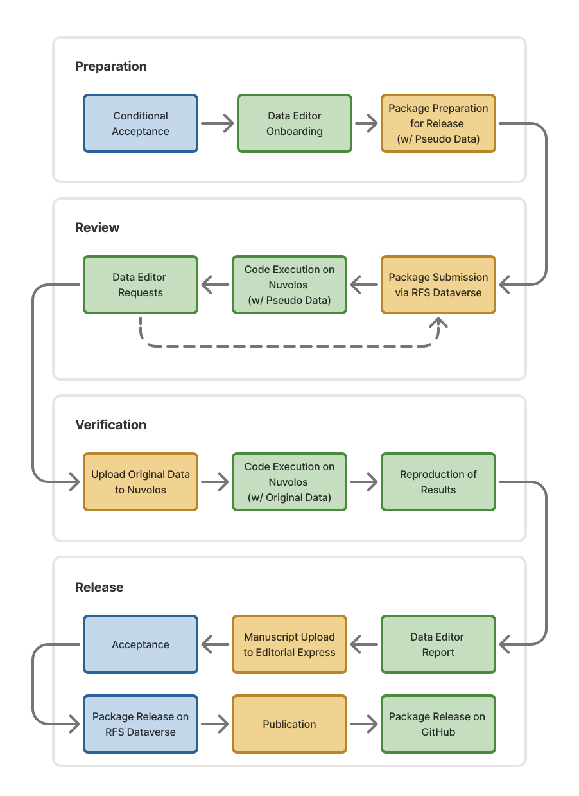

This website provides key information about the [**Code and Data Sharing Policy**](https://sfs.org/review-of-financial-studies/code-sharing-policy/) (CDSP) and the pre-acceptance reproducibility checks implemented at the *Review of Financial Studies* (RFS).

## Process

The diagram below illustrates how authors (yellow), editors (blue), and data editors (DE, green) interact throughout the editorial process.

{fig-alt="RFS Data Editor process diagram with four phases — Preparation, Review, Verification, and Release — and steps color-coded by responsibility (editor in blue, data editor in green, author in yellow)." fig-align="center"}

The data editor process unfolds in four phases following conditional acceptance.

- **Preparation**: All conditionally accepted manuscripts enter the data editing process. A DE first assesses whether a CDSP review is required. If a review is needed, the DE contacts the corresponding author with onboarding instructions; otherwise, the handling editor is notified directly. Authors then prepare a replication package intended for eventual public release, replacing any non-redistributable data with pseudo or synthetic equivalents. Every package must also include a comprehensive [README](https://social-science-data-editors.github.io/template_README/). To help authors prepare the README, the DE provide a [README prompt and checklist](readme.qmd) that walks through all required elements with best-practice examples. For other issues that arise during onboarding, please consult the [FAQs](faqs.qmd).
- **Review**: Authors submit the prepared package via the [RFS Dataverse](https://dataverse.harvard.edu/dataverse/rfs), where it remains private throughout the review. The DE configures a secure, dedicated virtual environment on Nuvolos following the submitted README and verifies that the code executes successfully with the pseudo data. If issues arise (e.g., execution errors, missing files, incomplete documentation, etc.), the DE sends requests to the authors, who revise and resubmit via the RFS Dataverse. This cycle continues until the code runs cleanly and the documentation is complete.
- **Verification**: Once the code runs successfully on pseudo data, the DE invites the authors into the secure environment to upload any raw data that cannot be shared publicly. The DE then executes the code with the original data and verifies that the code's output matches the results reported in the submitted manuscript. If the original raw data cannot be provided for verification, authors should reach out to the DE.
- **Release**: The DE submits a report to the handling editor summarizing the outcome of the verification process. The report typically details which data were available for verification and which results were verified or updated during the process. If the replication package yields results that differ substantially from those reported in the manuscript, the handling editor will determine whether to proceed with or reverse the original editorial decision. Upon successful verification, the DE releases the replication package on the RFS Dataverse and permanently and irrevocably deletes the virtual environment, along with any non-public data it contained. Authors then upload the resubmitted final version of the manuscript to Editorial Express. After final acceptance and publication, the DE may also host the verified code and accompanying report in a public GitHub repository under the [RFS organization](https://github.com/review-of-financial-studies).

Requests for exemption from the CDSP must be made at the time of *initial* submission — see the [Guidelines for Submission](https://sfs.org/guidelines-for-submissions/).

### Start From a Project Template

The fastest way to produce a compliant replication package and to avoid the most common issues is to start from one of the project templates we maintain. Each template encodes the recommended practices for its language.

::: {.grid}

::: {.g-col-12 .g-col-md-4}
#### [Stata Template](https://github.com/review-of-financial-studies/template-stata)

Project layout, `setup.do` for environment and `ado` packages, relative forward-slash paths, and a runnable `main.do`.
:::

::: {.g-col-12 .g-col-md-4}
#### [Python Template](https://github.com/review-of-financial-studies/template-python)

`uv`-based cross-platform lockfile, project-root execution via `uv run`, and `pathlib`-friendly relative paths.
:::

::: {.g-col-12 .g-col-md-4}
#### [R Template](https://github.com/review-of-financial-studies/template-r)

`renv.lock` for environment restoration, a project-root workflow (no `setwd()`), and consistent relative paths.
:::

:::

### Common Issues

Experience from prior reviews indicates that a limited set of recurring issues accounts for most delays during the data editor process. Many of these delays can be avoided by ensuring that the replication package includes a [README](https://social-science-data-editors.github.io/template_README/) that follows the Social Science Data Editors template (version 1.1) for standardized documentation, as well as a [LICENSE file](license.qmd) that clearly specifies the terms governing the use of the code and data.

Beyond these general requirements, the topics summarized below frequently arise during review and should ideally be addressed prior to submission:

| Topic | Stata | Python | R |
|------|-------|--------|---|
| **Project execution** | Do not use `cd` to change directories within scripts. Launch Stata from the project root (e.g., open `main.do` in the root or use a Stata project file). | Do not use `os.chdir()`. Run code from the project root (e.g., `uv run python main.py` or `runpy.run_path()`), with all paths relative to the root. | Do not use `setwd()`. Run R from the project root (e.g., open the folder directly in RStudio, Positron, or VS Code). |
| **File paths & portability** | Use relative paths with forward slashes (`/`). Avoid backslashes (`\`), which are Windows-specific. | Use relative paths with forward slashes (`/`) or `pathlib.Path`. Avoid hard-coded absolute paths. | Use relative paths with forward slashes (`/`). Do not rely on escaped backslashes (`\\`). |
| **Dependency management** | Document the Stata environment and required packages in `setup.do` (`ado`-path included). | Use reproducible, cross-platform lockfiles (e.g., `uv`) rather than `pip freeze`-based `requirements.txt`. | Use `renv.lock` to document and restore the R environment. |

## Further Information

- A list of common questions is maintained in the [FAQs](faqs.qmd).
- The [README prompt and checklist](readme.qmd) walk through all required elements with best-practice examples.
- Recommended practices on [licensing](license.qmd) is also available.
- A step-by-step guide explains how to upload replication packages to the [RFS Dataverse](dataverse.qmd).

## Contact

If you have any questions about the CDSP of the RFS and the above review process, please reach out to <a href="mailto:dataeditor@sfs.org">dataeditor@sfs.org</a>. If you have submitted your paper, please add the assigned manuscript ID to your communication.

Currently, [Christoph Scheuch](https://www.linkedin.com/in/christophscheuch/) and [Patrick Weiss](https://sites.google.com/view/patrick-weiss) act as data editors for the RFS.
